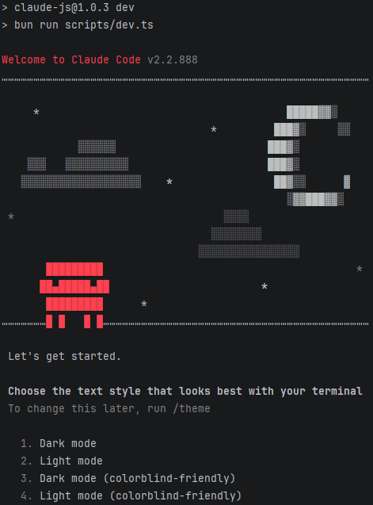
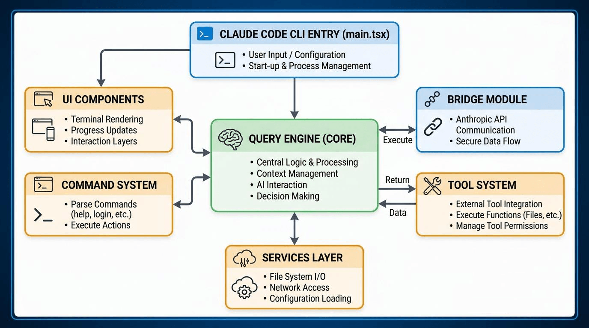

# AI Claude Code Build Guide

> This project is a reverse-engineered implementation of Anthropic Claude Code CLI, pre-configured to use the AceData cloud API proxy. It supports interactive AI coding in the terminal with chat UI and API key management.

---

[中文 README](README_zh.md) | [English README](README.md)

## 📖 Documentation Navigation

- **[Learn_Claude_Code.md](docs/Learn_Claude_Code.md)** - Deep dive into Claude Code architecture and Agent principles
- **[Claude_Research.md](docs/Claude_Research.md)** - Source snapshot research background and security analysis
- **[AI_Reimplementation.md](docs/AI_Reimplementation.md)** - Legal and ethical discussion on AI reimplementation
- **[testing-spec.md](docs/testing-spec.md)** - Testing specification documentation
- **[REVISION-PLAN.md](docs/REVISION-PLAN.md)** - Project revision plan

---

## 🚀 Quick Start

### Prerequisites

- **Bun** >= 1.2.0 (required)
- Git

### Installation & Running

```bash
# Clone the repository
git clone https://github.com/larack8/claw-code-cli
cd claw-code-cli

# Install dependencies
bun install

# Build the project
bun run build

# Run in development mode
bun run dev

# Or run CLI directly
./dist/cli.js
```



---

## 🔑 API Key Configuration

This project is pre-configured to use the **AceData Cloud** API proxy for Anthropic Claude.

### Method 1: Configure via settings.json (Recommended)

Edit `~/.claude/settings.json` (create if it doesn't exist):

```json
{
  "env": {
    "ANTHROPIC_AUTH_TOKEN": "your-api-token-here",
    "ANTHROPIC_BASE_URL": "https://api.acedata.cloud"
  }
}
```

### Method 2: Environment Variables

Set environment variables before running:

```bash
# Linux / macOS
export ANTHROPIC_AUTH_TOKEN="your-api-token-here"
export ANTHROPIC_BASE_URL="https://api.acedata.cloud"
./dist/cli.js

# Windows PowerShell
$env:ANTHROPIC_AUTH_TOKEN="your-api-token-here"
$env:ANTHROPIC_BASE_URL="https://api.acedata.cloud"
.\dist\cli.js
```

### Method 3: In-App Setup Command

After starting the CLI, type `/api-setup` to open the API configuration guide.

### How to Get Your API Token

1. Visit [AceData Cloud](https://acedata.cloud)
2. Register/login to your account
3. Navigate to API Keys section
4. Create a new API key
5. Copy the token and configure as shown above

---

## 📦 Building Binary Executables

Build standalone binary executables that don't require Bun to be installed.

### Quick Build (Current Platform)

```bash
bun run build:binary
```

### Platform-Specific Builds

```bash
# Windows (.exe)
bun run build:win

# macOS
bun run build:macos

# Linux
bun run build:linux
```

The compiled binaries will be placed in the `build/` directory:
- Windows: `build/claude-js.exe`
- macOS: `build/claude-js-macos`
- Linux: `build/claude-js-linux`

### Cross-Platform Compilation Notes

> **Important**: Bun's `--compile` flag creates self-contained executables but **cross-compilation is limited**. For best results, compile on the target platform:
> - Build Windows `.exe` on a Windows machine
> - Build macOS binary on a macOS machine
> - Build Linux binary on a Linux machine or in WSL2

### Running the Binary

```bash
# After building, run directly (no Bun required):

# Windows
.\build\claude-js.exe

# macOS / Linux (chmod first)
chmod +x build/claude-js-macos
./build/claude-js-macos
```

---

## 📋 Project Overview

### Project Information

| Item | Description |
|------|-------------|
| **Name** | `claude-js` |
| **Version** | `1.0.3` |
| **Description** | Reverse-engineered Anthropic Claude Code CLI — interactive AI coding assistant in the terminal |
| **Module Type** | ESModule (`"type": "module"`) |
| **Runtime Engine** | Bun >= 1.2.0 |
| **Entry Command** | `claude-js` → `dist/cli.js` |
| **API Provider** | AceData Cloud (`https://api.acedata.cloud`) |

### Background

The Claude Code source snapshot only contains the `src/` directory and `README.md`, missing all build configuration files. This project successfully restores the complete build environment by supplementing necessary configuration files, and adds API key configuration support for the AceData Cloud proxy.

---

## 📁 Project Structure



```
claw-code-cli/
├── src/                    # Source code directory
│   ├── entrypoints/
│   │   └── cli.tsx         # CLI entry file
│   └── commands/
│       └── api-setup/      # API configuration UI command
│           └── api-setup.tsx
├── packages/               # Workspace packages
│   ├── audio-capture-napi/
│   ├── color-diff-napi/
│   ├── image-processor-napi/
│   ├── modifiers-napi/
│   └── url-handler-napi/
├── docs/                  # Documentation directory
│   ├── Learn_Claude_Code.md
│   ├── Claude_Research.md
│   ├── AI_Reimplementation.md
│   ├── testing-spec.md
│   └── ... more docs
├── build/                  # Binary output directory (after build:binary)
├── dist/                   # JS bundle output directory
├── docs/                   # Documentation directory
├── build.ts                # Build script
├── package.json            # Project configuration
├── tsconfig.json           # TypeScript configuration
├── biome.json              # Biome code formatting configuration
├── knip.json               # Unused code detection configuration
└── mint.json               # Mintlify documentation configuration
```

---

## 🛠️ Available Scripts

| Command | Description |
|---------|-------------|
| `bun run build` | Build the project JS bundle (executes `build.ts`) |
| `bun run build:binary` | Build standalone executable for current platform |
| `bun run build:win` | Build Windows `.exe` binary |
| `bun run build:macos` | Build macOS binary |
| `bun run build:linux` | Build Linux binary |
| `bun run dev` | Development mode (executes `scripts/dev.ts`) |
| `bun test` | Run tests |
| `bun run lint` | Code linting |
| `bun run lint:fix` | Auto-fix code issues |
| `bun run format` | Format code |
| `bun run check:unused` | Check for unused code |
| `bun run health` | Health check |
| `bun run docs:dev` | Start documentation development server |

---

## 🔧 Core Configuration Files

### 1. package.json

The core configuration file that defines:

- **Package name**: `claude-js`
- **Version**: `1.0.3`
- **Entry point**: `src/entrypoints/cli.tsx`
- **Build output**: `dist/cli.js`
- **Binary output**: `build/claude-js[.exe]`
- **Workspaces**: Supports monorepo structure

### 2. tsconfig.json

TypeScript compilation configuration:

```json
{
  "compilerOptions": {
    "target": "ESNext",
    "module": "ESNext",
    "moduleResolution": "bundler",
    "jsx": "react-jsx",
    "strict": false,
    "skipLibCheck": true,
    "noEmit": true,
    "types": ["bun"]
  }
}
```

### 3. build.ts

Custom build script using Bun's native bundling capabilities:

- Clean output directory
- Bundle using `Bun.build()`
- Support code splitting
- Post-processing: Replace `import.meta.require` for Node.js compatibility

### 4. ~/.claude/settings.json

User settings file for API configuration:

```json
{
  "env": {
    "ANTHROPIC_AUTH_TOKEN": "your-token",
    "ANTHROPIC_BASE_URL": "https://api.acedata.cloud"
  }
}
```

---

## 📎 Core Technology Stack

### AI Service Integration

- **Anthropic SDK**: Official SDK, Bedrock SDK, Vertex SDK, Agent SDK
- **API Proxy**: AceData Cloud (`https://api.acedata.cloud`)
- **Cloud Service SDKs**: AWS SDK (Bedrock), Azure Identity, Google Auth Library
- **MCP Protocol**: `@modelcontextprotocol/sdk` - Model Context Protocol

### Terminal UI

- **React**: Terminal UI rendering using React
- **react-reconciler**: Custom renderer
- **chalk**: Terminal colors
- **cli-highlight**: Code highlighting
- **figures**: Terminal icons
- **wrap-ansi**: ANSI text wrapping

### Observability

- **OpenTelemetry**: Complete observability stack
	- Trace, Metrics, Logs exporters
	- Support for OTLP (gRPC/HTTP/Proto)
	- Prometheus exporter

### Utility Libraries

- **lodash-es**: Utility functions
- **zod**: Runtime type validation
- **yaml**: YAML parsing
- **semver**: Semantic versioning
- **diff**: Text diff comparison
- **fuse.js**: Fuzzy search

---

## 🎯 Project Features

1. **Bun Runtime Based**: Leverages Bun's high performance and native TypeScript support
2. **React Terminal Rendering**: Build terminal UI using React for declarative interactive experience
3. **AceData Cloud Integration**: Pre-configured to use AceData Cloud API proxy for Claude access
4. **API Key UI Management**: Built-in `/api-setup` command for configuring API credentials
5. **Multi-Cloud Support**: Supports Anthropic direct connection, AWS Bedrock, Google Vertex, Azure
6. **Standalone Binary**: Compile to single executable for Windows, macOS, and Linux
7. **MCP Protocol Integration**: Supports Model Context Protocol
8. **Complete Observability**: Integrated OpenTelemetry for distributed tracing and monitoring
9. **Monorepo Architecture**: Manages multiple packages using workspaces
10. **Modern Toolchain**: Biome (formatting/linting), Knip (dead code detection)

---

## 📑 Development Guide

### Build Process

1. **Clean**: Remove old `dist/` directory
2. **Bundle**: Bundle TypeScript/TSX using `Bun.build()`
3. **Post-process**: Replace Bun-specific APIs for Node.js compatibility
4. **Binary** (optional): Use `bun build --compile` for standalone executable

### Code Quality

- Use **Biome** for code formatting and linting
- Use **Knip** to detect unused code
- Use **TypeScript 6.0.2** for type checking

---

## 🔗 Related Resources

- [Anthropic Claude](https://www.anthropic.com/claude)
- [AceData Cloud](https://acedata.cloud)
- [Bun Official Documentation](https://bun.sh/docs)
- [Model Context Protocol](https://modelcontextprotocol.io/)
- [OpenTelemetry](https://opentelemetry.io/)

---

## ⚠️ Disclaimer

This project is a research and analysis of the publicly exposed Claude Code source snapshot, intended solely for educational purposes, security research, and software supply chain analysis. See [Claude_Research.md](docs/Claude_Research.md) for details.

---

## 📄 License

Please refer to the original project's license terms. This documentation and supplementary configuration files follow the corresponding open source licenses.
